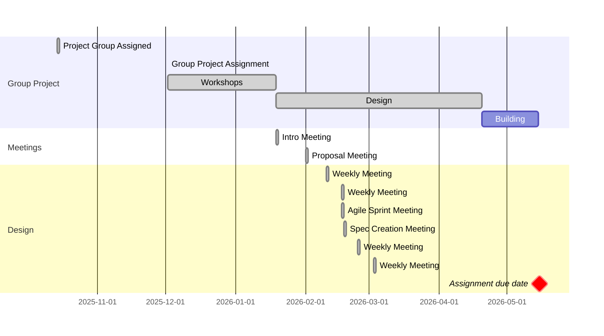

## Group Formation
A group of people was formed from the cohort of students studying the _Robotic
Modelling and Drone Skin Design_ module as part of the _AI &amp; Robotics_
Bachelor's degree, for the purpose of designing, manufacturing and assembling
a product suitable for demonstrating the following technologies:

* 3D scanning hardware and software
* Motion capture hardware and software
* Computer Aided Design (CAD) software
* 3D modelling software
* Haptic input hardware paired with associated 3D sculpting software
* 3D printing hardware
* Laser cutting hardware
* Resin production and postproduction

A well-balanced group emerged from the formation process, with a varied
combination of specialities, including proficiency at 3D modelling with Blender,
ability to create both 2D and 3D designs using CAD software, skill in woodworking,
and extensive experience with relevant electronic components such as servo motors
and the allowances, required to house and connect them.

## Brainstorming Project Ideas
After exploring the available resources and playing with some ideas, the group
unanimously decided to persue the creation of an alien-like head, inspired by
H.R. Giger's "Xenomorph" design for the 1979 film "Alien". A servo motor would
drive a mechanism that would simultaneously open the jaw and extend a tongue
featuring an inner-jaw out of the mouth that would "salivate" hand soap or hand
sanitiser. In the following weeks, the group attended a series of workshops, in
which the aforementioned technologies were demonstrated, explored and
experimented with.

<figure>


```
```

  <figcaption>The initial Gantt chart, agreed on by all group members</figcaption>
</figure>
