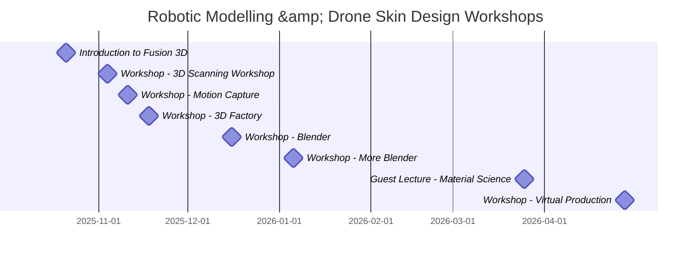

A series of workshops were organised to facilitate the group's exposure to the
technologies and tools required to complete the _Soapomorph_ project.

## 3D Modelling
The workshops provided the group with opportunities for hands-on experience with
two 3D modelling software packages: _Autodesk Fusion_ and _Blender_, each
posessing advantages and drawbacks depending on the use case.

### Autodesk Fusion
_Autodesk Fusion_, formerly known as _Fusion 360_, is a 3D modelling software
specialising in the creation of manufacturable objects and structural designs,
and the simulation of movement and interactions between them.
<figure>
  
  <figcaption>A gear, designed in <em>Autodesk Fusion</em></figcaption>
</figure>

### Blender
_Blender_ is also a 3D modelling software, but with a focus on the creation of
artistic models, flexible and dynamic scenes and animations, and rigging models
to allow them to be animated with realistic movements.

### Comparison
While these software packages specialise in different areas, they share a common
function of creating 3D models and, with attention to detail, can both be used
to create components with sufficiently precise sizing for an aesthetically
focused hardware project.

## 3D Scanning

## Motion Capture

## Laser Cutting

## Material Science

## Virtual Production

