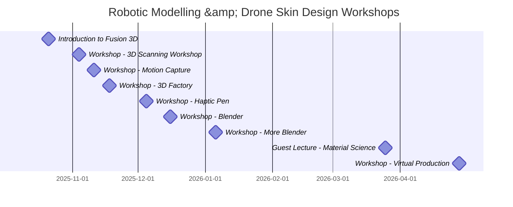

A series of workshops were organised to facilitate the group's exposure to the
technologies and tools required to complete the _Soapomorph_ project.

<figure>

  <figcaption><strong><em>Figure 1</em></strong>: The schedule for workshops throughout the year.</figcaption>
</figure>

## 3D Modelling
The workshops provided the group with opportunities for hands-on experience with
two 3D modelling software packages: _Autodesk Fusion_ and _Blender_, each
possessing advantages and drawbacks depending on the use case.

### Autodesk Fusion
_Autodesk Fusion_, formerly known as _Fusion 360_, is a 3D modelling software
specialising in the creation of manufacturable objects and structural designs,
and the simulation of movement and interactions between them.
<figure>
  
  <figcaption><strong><em>Figure 2</em></strong>: A gear, designed in <em>Autodesk Fusion</em>.</figcaption>
</figure>

### Blender
_Blender_ is also a 3D modelling software, but with a focus on the creation of
artistic models, flexible and dynamic scenes and animations, and rigging models
to allow them to be animated with realistic movements.

### Comparison
While these software packages specialise in different areas, they share a common
function of creating 3D models and, with attention to detail, can both be used
to create components with sufficiently precise sizing for an aesthetically
focused hardware project.

## 3D Sculpting
The group was allowed supervised access to a haptic pen for the purpose of
partaking in the art of 3D sculpting. Like traditional 3D modelling, 3D
sculpting also allows the user to create a digital 3D model, but requires a
level of artistry above even Blender to achieve aesthetically pleasing results.

The device consists of a pen on a small robotic arm that tracks the pen's
movement and applies precise amounts of force feedback to simulate the effect of
the pen pushing against the surface of a clay-like material. From the user's
perspective, it feels like moulding a real, tangible material, but as a result,
requires levels of coordination and practice more comparable to a potter or
ceramic artist. A skilled artist can use the fine-grained haptic feedback to
manifest intricate, realistic, organic-looking shapes such as faces, hands and
plants.

## 3D Scanning
The _3D Scanning_ workshop provided the group with access to the [HandySCAN BLACK|Elite](https://www.creaform3d.com/en/products/portable-3d-scanners/portable-3d-scanner-handyscan-3d/technical-specifications), a powerful piece of hardware capable of capturing extensive
measurements of the surface of solid objects, creating digital copies of them.
This is extremely useful for a variety of applications from virtually inserting
the a 3D representation of the object in a digital scene, to non-destructively
prototyping changes to the original object.

Solid, matte finished surfaces are ideal for capturing with 3D scanners, as the
light reflects in a reliable manner, while smooth and reflective, or overly soft,
fluffy surfaces incur a high risk of missing data, as illustrated in the figure
below.

<figure>
  
  <figcaption><strong><em>Figure 3</em></strong>: Missing data in 3D scan caused by a reflective surface, captured by a group member.</figcaption>
</figure>

## Motion Capture
The group visited the motion capture studio in Cadman building, where smart
tracking cameras so precise that they require a warm-up period and calibration
at the beginning of a capture session, are used in conjunction with reflective
adhesive markers and optical motion capture suits to precisely record every
motion of the desired parts of the user's body, even down to individual digits
when using the specialised gloves.

These measurements can be used to puppet humanoid character models, recreating
the movements of the user, allowing for realistic, believable digital characters.

## Laser Cutting
The 3D factory also provides access to laser cutting machines, which are best
used for creating precise, complex, flat shapes. The group was shown how to use
Adobe Illustrator to draw clean 2D shapes that can be cut out of 3mm-thick
acrylic plastic and plywood. Drawing red lines in the document programs the laser
to cut through the material, but it can also be configured to stop short of
cutting all of the way through by using shades of black or gray, allowing for
clean, aesthetically pleasing illustrations to be cut into panels.

This method is particularly useful for creating structural parts, such as flat,
interlocking panels, provided that they don't need to bear a lot of weight.

While _Adobe Illustrator_ is used by the technicians in the 3D factory, and its
_.ai_ file format is supported by the laser cutters, free-to-use open source
vector drawing software such as _Inkscape_ is also available, and can export
_Scalable Vector Graphics_ (SVG) files, which can be imported into
_Adobe Illustrator_ and used with the laser cutters. Both software packages
are equipped with tools allowing streamlined drawing of functional parts, such as
snapping to a grid, drawing features equidistantly from an origin, and flipping
features to create symmetrical parts.

## Material Science
The group attended a guest lecture about Material Science, in which they were
introduced to the _Ansys Edupack_ software. It is a software suite designed to
leverage a comprehensive database of material properties to aid in selecting
appropriate materials for a given application.

Setting limits, such as desired temperature, elastic modulus (stiffness),
conductivity, chemical properties such as durability against water, fire, heat,
cold, or a range of other properties allows for creating concise charts showing
only the most suitable materials for a given application.

## Virtual Production
The _virtual production_ workshop demonstrated how motion tracking cameras,
powerful graphics hardware, a display wall, and specialised software can use
tracking data from a rig being moved within a room to localise increased
resolution and post-processing in a region behind it and create the illusion of
a real, tangible object existing within a virtual scene.

For a project like _Soapomorph_, or a similar artistic endeavour, _virtual
production_ could be used to test concepts quickly, like testing for suitable
environments without having to build a physical set each time (Hendry, M.F. _et al._, 2023).

## Summary
These workshops provided the group with the context, knowledge and skills to
select which of them were appropriate for creating the _Soapomorph_.
